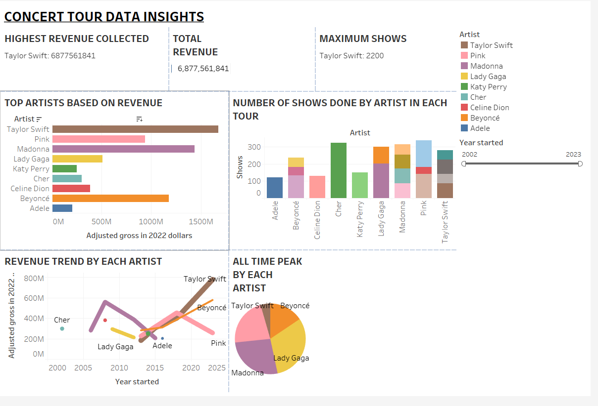

# 🎤 Concert Tour Data Analysis

This project analyzes concert tour grossing datasets from Kaggle to uncover patterns in revenue, ticket sales, and artist performance across different tours.

## 🔍 Objectives
- Clean and preprocess raw concert data from Kaggle.
- Perform exploratory data analysis (EDA) with Pandas and NumPy.
- Visualize trends in ticket pricing, gross revenue, and attendance.

## 🛠 Tools & Libraries
- Python (Pandas, NumPy, Matplotlib, Seaborn)
- Jupyter Notebook
- Kaggle dataset: [Top Concert Tours](https://www.kaggle.com/datasets/amruthayenikonda/dirty-dataset-to-practice-data-cleaning)

## 📊 Key Insights
- Identified top-grossing artists and tours over time.
- Found strong correlation between ticket price and gross revenue.
- Discovered seasonal trends in tour scheduling and audience size.

## 📷 Sample Visualizations

## 
